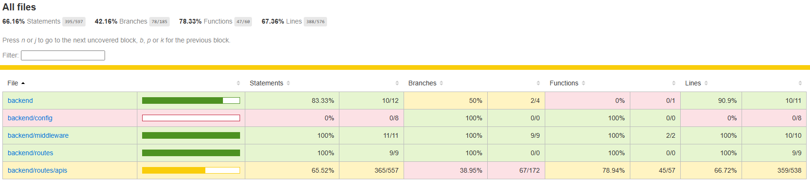

# Unit Testing Report

## Project Information
This report documents the unit testing implementation for the Checky backend application. We have successfully implemented comprehensive unit test suites covering critical functionality including authentication, user management, class management, and notification systems.
- **Project Name:** Checky - Backend API
- **Testing Framework:** Jest
- **Test Runner:** Jest with Babel transformation

---

## Test Coverage Results

- **Total Test Suites:** 11/11 passed
- **Total Test Cases:** 92/92 passed
- **Success Rate:** 100%

---

## Test Suite Overview

We have implemented **3 unit test suites** testing 3 different methods/features:
1. **Authentication Middleware** - `authenticateJWT()` method
2. **Get User by ID** - `GET /auth/:id` endpoint
3. **Get Notifications for User** - `GET /notifications/` endpoint

Each test suite contains multiple test cases using various testing techniques (ISP, Branch Coverage, Logic Coverage).

---

## Test Suite 1: Authentication Middleware
**Method Under Test:** `authenticateJWT(...)`\
**File Location:** `middleware/auth.js`\
**Purpose:** JWT authentication middleware that validates tokens and enforces role-based access control

### Test Cases

| Test Method | Scenario | Input | Mock Behavior | Expected Result |
| :--- | :--- | :--- | :--- | :--- |
| `testAuth_MissingToken` | **Error**: No token provided | No Authorization header or cookie | N/A | **401 Unauthorized** Error: "Unauthorized" |
| `testAuth_InvalidToken` | **Error**: Malformed/expired token | Authorization: "Bearer abc" | `jwt.verify()` throws error | **401 Unauthorized** Error: "Invalid or expired token" |
| `testAuth_InsufficientRole` | **Error**: Valid token, wrong role | Authorization: "Bearer validtoken" | `jwt.verify()` returns `{userid: 1, role: "student"}` | **403 Forbidden** Error: "Forbidden: insufficient role" |
| `testAuth_ValidAccess` | **Success**: Valid token and role | Authorization: "Bearer validtoken" | `jwt.verify()` returns `{userid: 99, role: "teacher"}` | **200 OK** User data attached to request |

**Testing Techniques Applied:**
- **Branch Coverage** — ensures all authorization paths (missing token, invalid token, insufficient role, valid access) are executed.

---

## Test Suite 2: Get User by ID
**Endpoint:** `GET /api/v1/auth/:id`\
**File Location:** `routes/apis/user.js`\
**Purpose:** Retrieves a specific user's information from the database by their user ID

### Test Cases

| Test Method | Scenario | Input | Mock Behavior | Expected Result |
| :--- | :--- | :--- | :--- | :--- |
| `testGetUserById_Success` | **Success**: User found | `GET /api/v1/auth/1` | `db.query()` returns user with ID 1 | **200 OK** JSON: User object with all fields |
| `testGetUserById_NotFound` | **Error**: User not found | `GET /api/v1/auth/999` | `db.query()` returns empty array | **404 Not Found** Error: "User not found" |
| `testGetUserById_DatabaseError` | **Error**: Database failure | `GET /api/v1/auth/1` | `db.query()` throws error | **500 Internal Server Error** Error: "DB error" |

**Testing Techniques Applied:**
- **Input Space Partitioning (ISP)** — partitions user ID inputs into valid, non-existent, and error categories.

---

## Test Suite 3: Get Notifications for User
**Endpoint:** `GET /api/notifications/`\
**File Location:** `routes/apis/notification.js`\
**Purpose:** Retrieves all notifications for the authenticated user, ordered by creation date

### Test Cases

| Test Method | Scenario | Input | Mock Behavior | Expected Result |
| :--- | :--- | :--- | :--- | :--- |
| `testGetNotifications_Success` | **Success**: User has notifications | Authenticated request (userid: 1) | `authenticateJWT()` sets `req.user.userid = 1` `db.query()` returns 2 notifications for user 1 | **200 OK** JSON: Array of 2 notifications |
| `testGetNotifications_DatabaseError` | **Error**: Database failure | Authenticated request | `db.query()` throws error | **500 Internal Server Error** Error: "DB error" |

**Testing Techniques Applied:**
- **Logic Coverage** — ensures correctness of query logic filtering notifications for a user.

---

